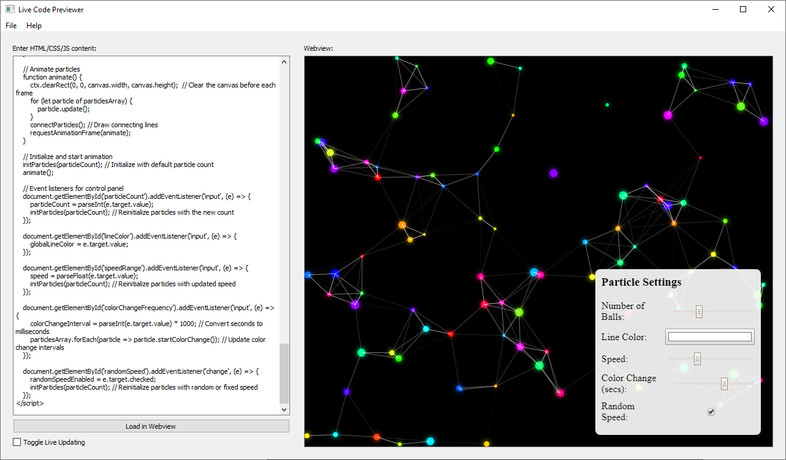
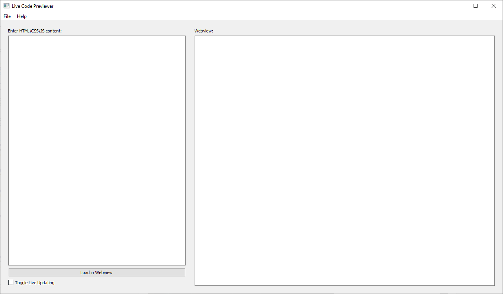

# Live Code Previewer

**Live Code Previewer** an app that allows users to write and preview HTML, CSS, and JavaScript code in real-time. 
The app features a side-by-side layout where users can input code on the left side and instantly preview it on the right side in a webview.

## Screenshot

## Features

- **Live Code Preview**: As you type HTML content in the left-hand text area, the webview on the right automatically updates to show the rendered output.
- **Debugger**: Enable or disable the debugger.
- **Manual Update Option**: You can disable live updating by unchecking the "Toggle Live Updating" checkbox. In this mode, the webview is updated only when you click the "Load in Webview" button.
- **HTML, CSS, and JavaScript Support**: You can input not just HTML, but also include CSS and JavaScript directly in the text area for live rendering.
- **Local File Support**: Local images/scripts/etc work relative to the app folder, you can take the EXE and place it in the same folder as your html/css/js projects.

## Installation

To run the **Live Code Previewer**, you need to have Python 3 installed on your system. Additionally, you will need to install the following dependencies:

1. [PyQt5](https://pypi.org/project/PyQt5/)
2. [PyQtWebEngine](https://pypi.org/project/PyQtWebEngine/)

You can install these dependencies using pip:

\`\`\`
pip install PyQt5 PyQtWebEngine
\`\`\`

## Usage

1. Clone this repository:
   \`\`\`
   git clone https://github.com/non-npc/live-code-previewer.git
   cd live-code-previewer
   \`\`\`

2. Run the application:

   \`\`\`
   python main.py
   \`\`\`

3. The application window will open with two columns:
   - **Left Column**: A text area for writing HTML, CSS, and JavaScript code.
   - **Right Column**: A webview to preview the code in real time.

4. By default, the webview displays an empty preview area bordered in grey. As you type code into the text area, the webview updates with your content if live updating is enabled. You can disable live updating by unchecking the "Toggle Live Updating" checkbox.

5. To manually update the preview, enter your code in the text area and click "Load in Webview."

## Example

Here’s a simple example you can try in the text area to get started:

\`\`\`html
<h1>Hello, World!</h1>

This is a live HTML previewer!

\`\`\`

## File Structure

\`\`\`
live-code-previewer/
│
├── main.py              # The main script to launch the application
└── README.md            # This readme file

\`\`\`

## Contributing

Contributions are welcome! If you'd like to contribute to the project, feel free to open an issue or submit a pull request.

## License

This project is licensed under the MIT License. See the [LICENSE](LICENSE) file for more details.

